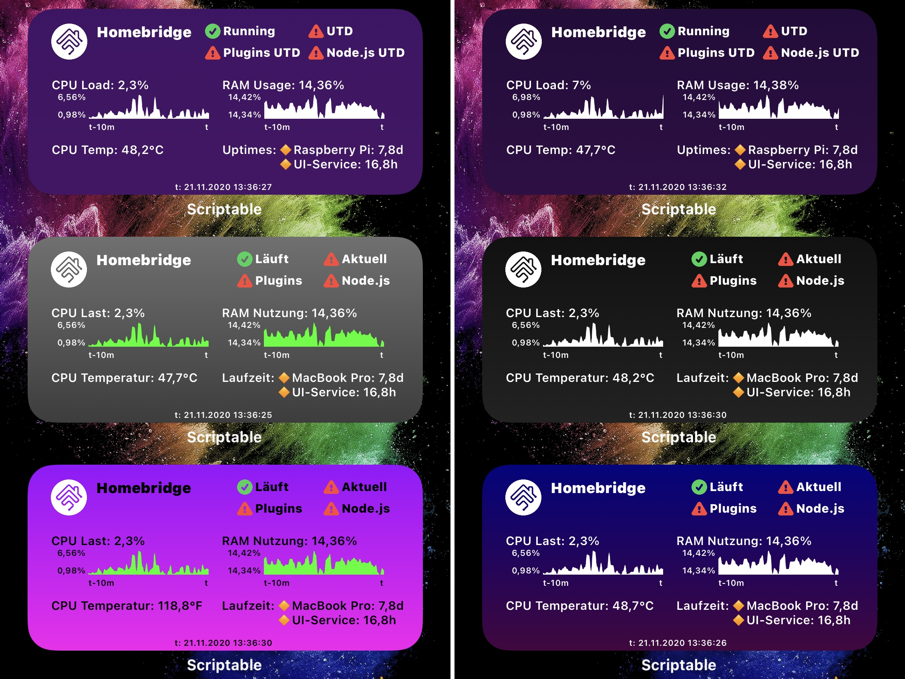

# Homebridge Status Widget
- Script for the iOS App Scriptable that shows a small summary of your Homebridge instance
- All infos shown are based and provided by the Homebridge Config UI X found at https://github.com/oznu/homebridge-config-ui-x
- Thanks to the github user oznu for providing such a nice programm!
- This script does not work if you don't have the Homebridge service (Homebridge Config UI X) running
- This script was developed with Homebridge Config UI X in version 4.32.0 (2020-11-06), Homebridge at version 1.1.6 and Scriptable app in version 1.6.1 on iOS 14.2. Maybe you need to update the UI-service OR Homebridge OR the Scriptable app OR your iPhone if this script does not work for you
- also thanks to github user kevinkub for providing a line chart example at https://gist.github.com/kevinkub/b74f9c16f050576ae760a7730c19b8e2

# How to use (3 setup possibilities)
- the best way (updatable, supporting the install script from https://scriptdu.de (very recommended)):
  - the script has a configuration mechanism that saves all configurations (in the Configuration class) to iCloud persistently
  - this means the configuration you make can be reused once you install a newer version of this script
  - following variables exist in the configuration: 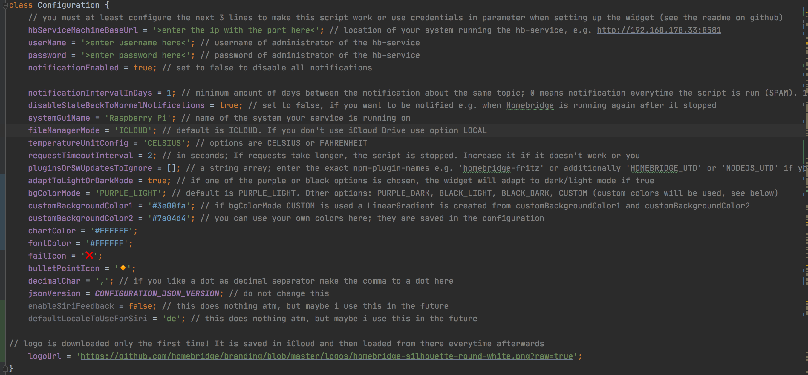
  - three variables controll this mechanism:
     - configurationFileName = 'purple.json' // change this to an own name e.g. 'configBlack.json' . This name can then be given as a widget parameter in the form 'USE_CONFIG:yourfilename.json' so you don't loose your preferred configuration across script updates (but you will loose it if i have to change the configuration format)
     - usePersistedConfiguration = true; // false would mean to use the visible configuration below; true means the state saved in iCloud (or locally) will be used
     - overwritePersistedConfig = false; // if you like your configuration, run the script ONCE with this param to true, then it is saved and can be used via 'USE_CONFIG:yourfilename.json' in widget params
  - so basically what you need to do is:
     - choose a configurationFileName (must end with '.json')
     - set overwritePersistedConfig to true
     - configure every configuration-variable exactly as you want (including the CREDENTIALS and the URL!)
     - run the script once (this creates a json file in icloud, you can always delete it to start from scratch)
     - set overwritePersistedConfig to false
     - set the widget up with a single parameter in the format 'USE_CONFIG:yourfilename.json' 
  - as long as overwritePersistedConfig is false, any change to the config won't take any effect because the persisted one is used if usePersistedConfiguration is true
- another updatable way (but configuration is lost):
   - set the widget up with parameter in the format \<username>,,\<password>,,\<hbServiceMachineBaseUrl>
   - a valid real example: "admin,,mypassword123,,http://192.168.178.33:8581"
   - if you have authentication set to non in UI-X then just provide any char. Valid would be e.g. "x,,x,,http://192.168.178.33:8581"
   - maybe you need to set usePersistedConfiguration in the config to false to use this older way
   - screenshot of an example when setting it up: 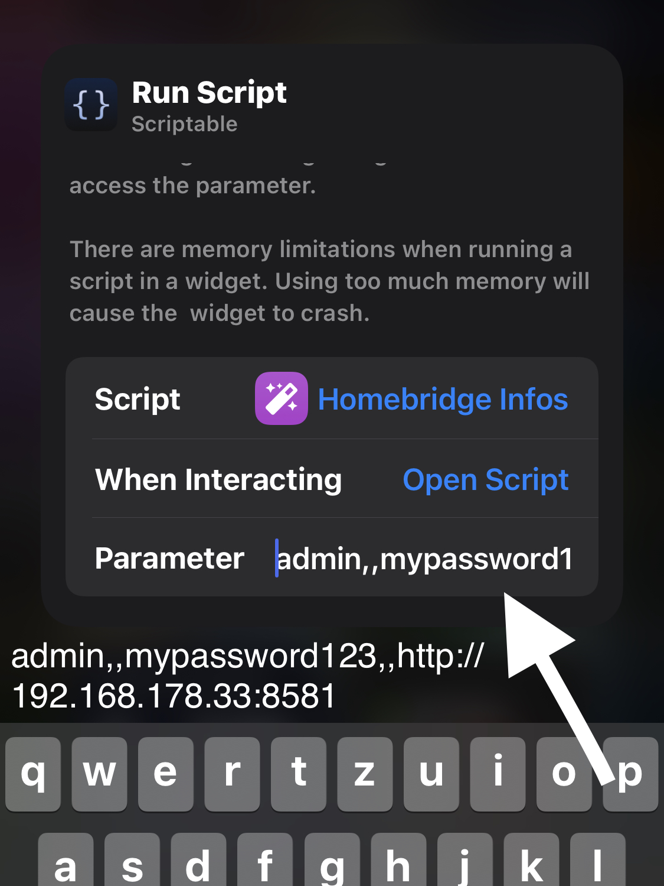

- hard coded way in the script (not recommended): you need to configure 
   - the **URL** of the system running the Homebridge Config UI X (the hb-service), including the port e.g. http://192.168.178.33:8581
   - **username** of the administrator of the homebridge-config-ui-x instance (not the actual linux user)
   - **password** of the administrator of the homebridge-config-ui-x instance
   - the residual parameter can be tweaked a bit for your needs
   - e.g. fileManagerMode, must be set to LOCAL if you do not use iCloud Drive. Default is ICLOUD
   - e.g. the systemGuiName, the name of your system running the Homebridge Config UI X (the hb-service)
   - e.g. the timeout could be increased if your system does not respond within 2 second
   - e.g. set the temperatureUnitConfig to 'FAHRENHEIT' to use °F instead of °C
- if your homebridge-config-ui-x instance is not reached within the specified timeout (currently 2sec) the following screen is shown: 

# Notifications
- the widget now can notify you when a status has changed
- you will get a notification if:
  - your Homebridge stopped running
  - there is an update available for Homebridge
  - there is an update available for one of your plugins
  - there is an update available for node.js
- disable notifications by setting notificationEnabled to false
- enable getting notification when any status was red and is now back to green (normal) by setting the variable disableStateBackToNormalNotifications to false
- edit the variable notificationIntervalInDays to lengthen or shorten the time between getting the same notification (e.g. plugin update available) again
  - 0 means you get a notification every time the script runs (not recommended)
  - 1 means you get each possible notification to a maximum of 1 time per day
  - 0.5 means you get each possible notification to a maximum of 2 times per day
- Open a notification to reveal the "Show me!" button which takes you directly to Homebridge Config UI X
- Here are some screenshots: 
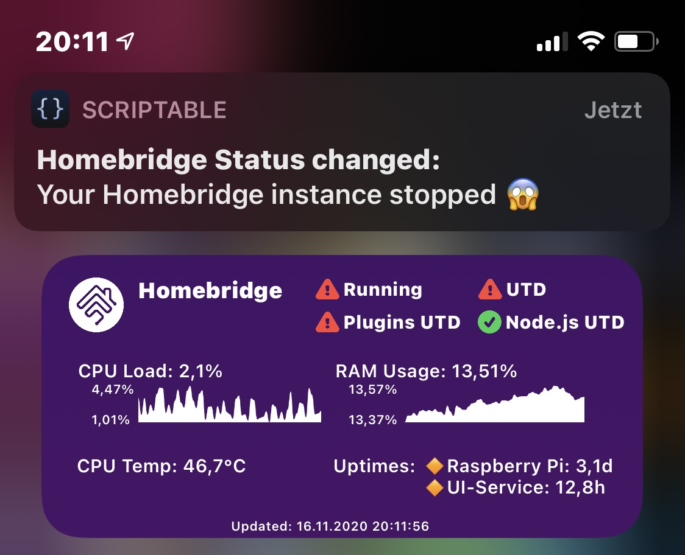
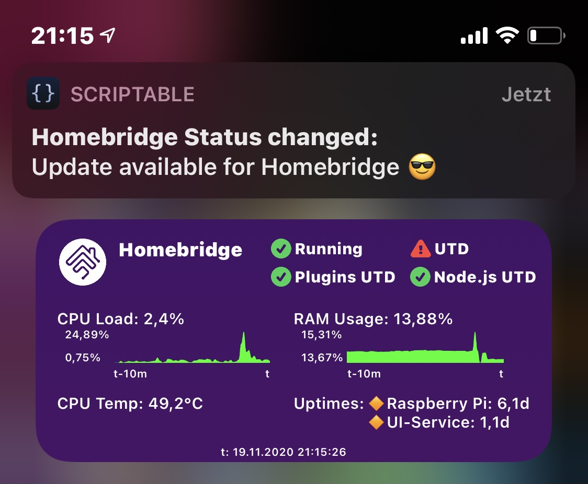
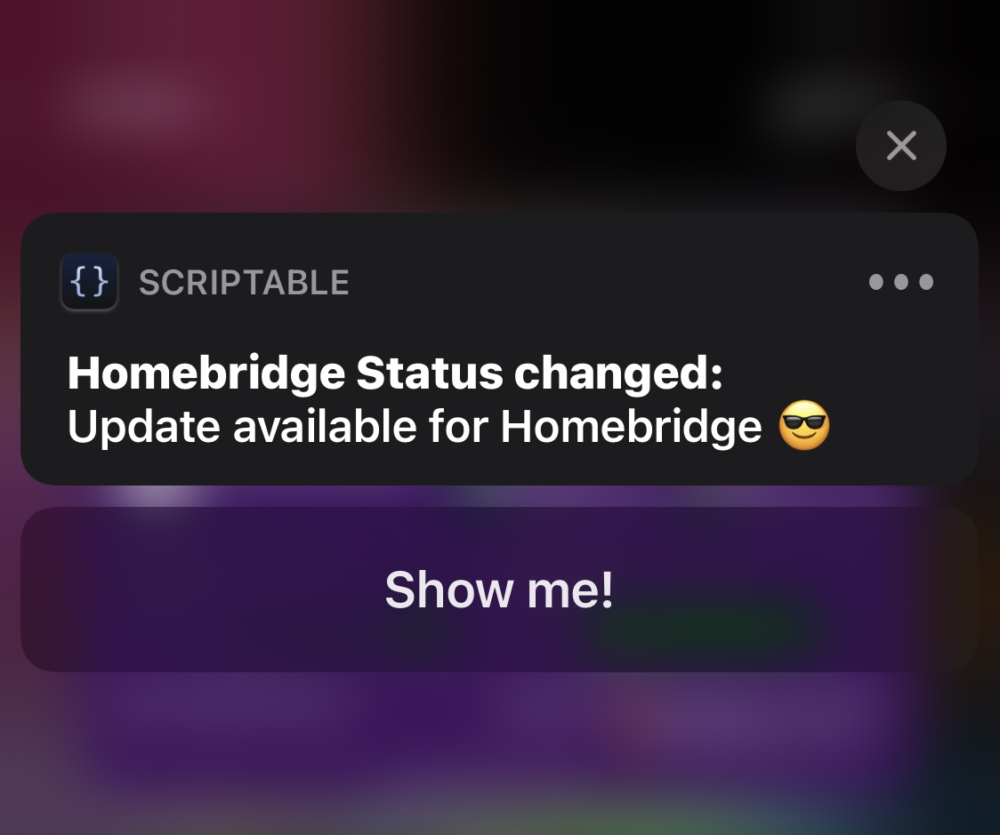

# Ignoring specific plugin or software updates
- by filling the empty array of the variable pluginsOrSwUpdatesToIgnore with strings, you can now configure to ignore plugins, Homebridge or Node.js during checking for updates
- succesfully ignored software will not influence the shown status (e.g. ignoring homebridge UTD status will result in showing the green status always even if there is an update available)
  - for ignoring plugins, enter their npm name (e.g. 'homebridge-fritz') as string in the given empty array 
  - for ignoring Homebridge enter 'HOMEBRIDGE_UTD' and for Node enter 'NODEJS_UTD' in the empty array
  - a valid example of the variable would be const pluginsOrSwUpdatesToIgnore = ['homebridge-fritz', 'HOMEBRIDGE_UTD', 'NODEJS_UTD'];
  - if you specify something and run the script inside the Scriptable app, you will get a log output to let you know that you ignored something successfully

# Special GUI when running the script via Siri shortcut
- when you set up a shortcut that executes the script, a different GUI is shown
- the Siri GUI shows a simple list of available updates so you can check now which of the software have an update
- also i coded in to let siri speak an answer. This can be disabled by setting the according property in the configuration.
- this is what it looks like:  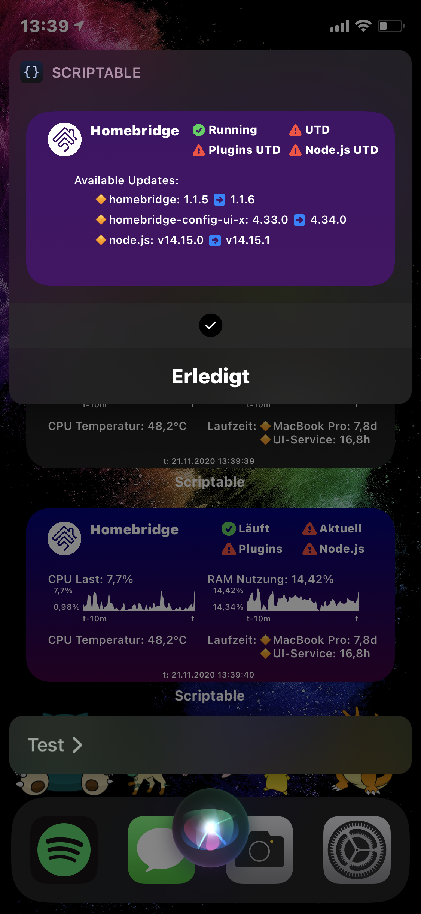

# Support for iOS 16 lock screen widgets
- you can configure the widget to show on iOS 16's lock screen
- there is nothing to do additionally, the configuration is just as before
- there is only support for the widget that takes up 2 of the 4 slots
- this is what it looks like:  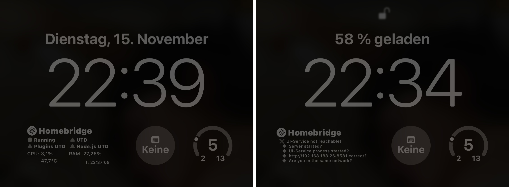

# Styling
- all things shown below are saved in the configuration file and can be reused in the future after the script logic updates
- all important texts can be changed to your own texts 
  - if you change the top right texts you probably need to adapt the spacing (play around with the variables spacer_beforeFirstStatusColumn, etc and also with spaces in the text)
- at the top of the script there is a variable bgColorMode that you can set to 'PURPLE_LIGHT', 'PURPLE_DARK', 'BLACK_LIGHT', BLACK_DARK', or 'CUSTOM'
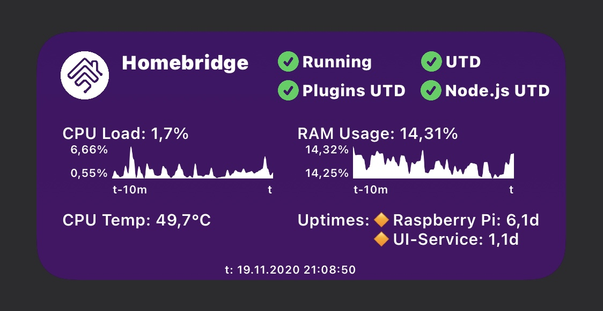
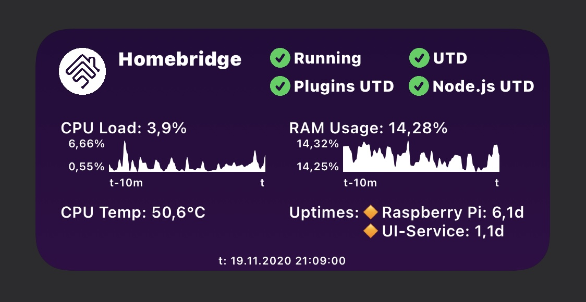
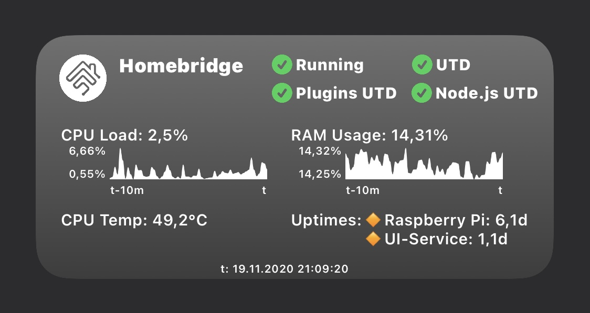
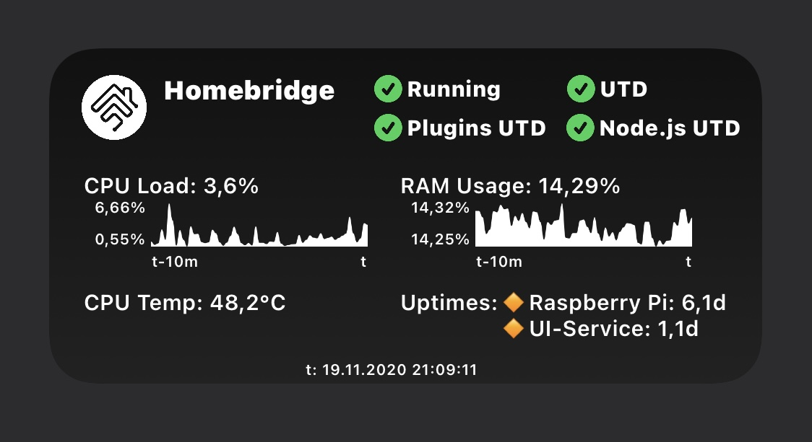
- in CUSTOM mode the values defined in customBackgroundColor1_light, customBackgroundColor2_light, customBackgroundColor1_dark and customBackgroundColor2_dark are used (you can choose!) 
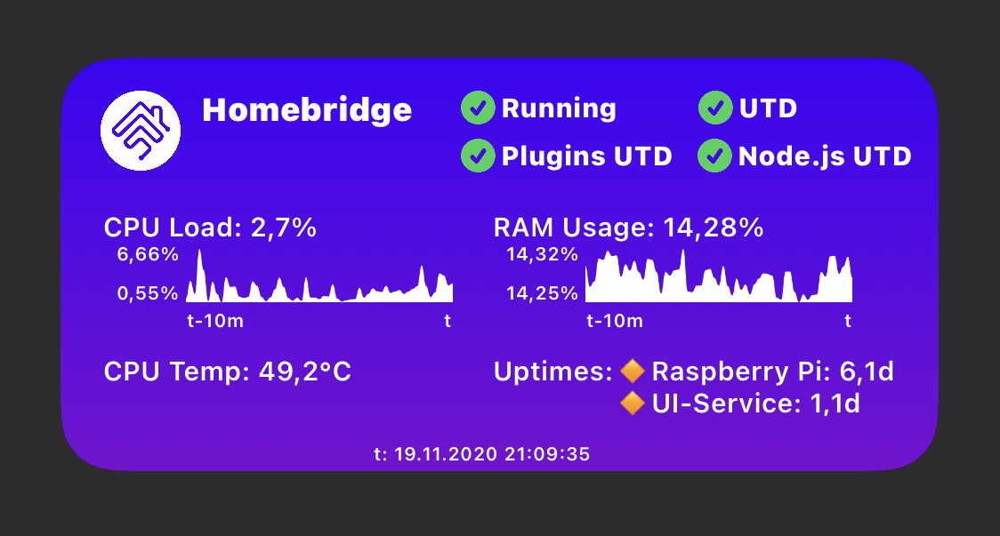
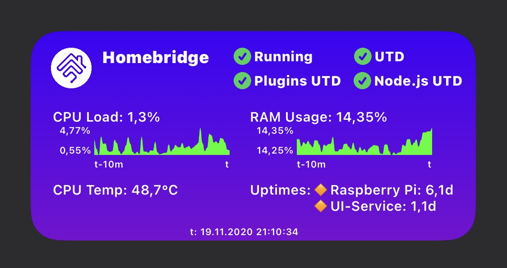
- adaptToLightOrDarkMode toggles to react to light/dark mode automatically
  - if you use adaptToLightOrDarkMode with mode CUSTOM then customBackgroundColor1_light and customBackgroundColor2_light together are used in the light version and of course customBackgroundColor1_dark and customBackgroundColor2_dark in the dark version
- fontColor_light and fontColor_dark sets all texts to your chosen color (default is fontColor_light). Works together with adaptToLightOrDarkMode
- chartColor_light and chartColor_dark controls which color the charts have (default is chartColor_light). Works together with adaptToLightOrDarkMode
- you even can experiment with logoUrl and choose another logo to download from anywhere
- you can change the SFSymbols used together with their color (the icons) and the emojis failIcon = ❌ and bulletPointIcon = 🔸 by providing any other emoji

# Infos shown in the widget
- if Homebridge is running
- if Homebridge is up to date
- if all of the installed plugins (including Homebridge Config UI X) are up to date
- if node.js is up to date
- CPU load
- CPU temperature
- RAM usage
- Uptime for the system the hb-service is running on
- Uptime for the hb-service (Homebridge Config UI X)

# Troubleshoot
- if the temperature is not shown for you, then the information is not available on your machine
- triple check the credentials (2FA currently not supported)
- consider increasing the requestTimeoutInterval variable
- if some error occurs always check that you have the matching versions
  - the Scriptable app 1.6.1
  - Homebridge Config UI X 4.32.0 (2020-11-06)
  - Homebridge 1.1.6
  - iOS 14.2
- if your Homebridge Config UI X is reachable and the authentication process succeeded but the further API requests take to long or fail you will get a screen similar to 
- open a github issue if you can't figure it out what the problem is