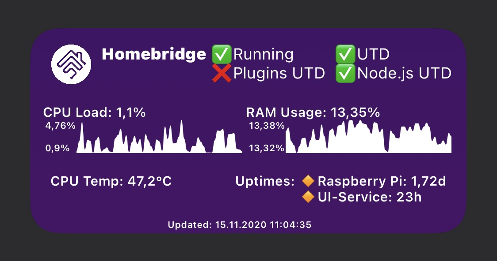
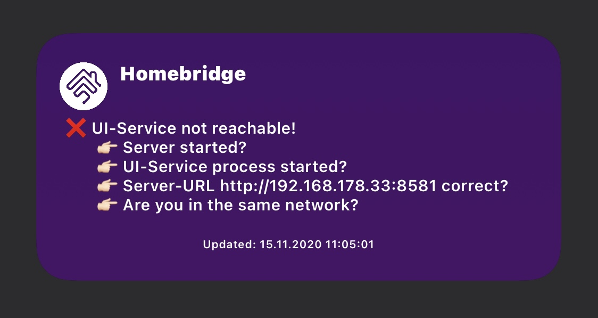
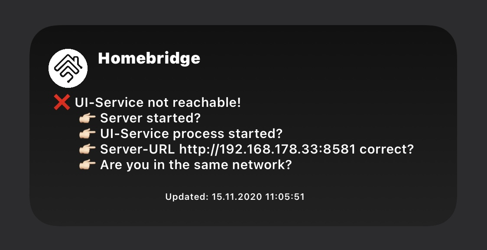

# Homebridge Status Widget
- Script for the iOS App Scriptable that shows a small summary of your Homebridge instance
- All infos shown are based and provided by the Homebridge Config UI X found at https://github.com/oznu/homebridge-config-ui-x
- Thanks to the github user oznu for providing such a nice programm!
- This script does not work if you don't have the Homebridge service (Homebridge Config UI X) running
- This script was developed with Homebridge Config UI X in version 4.32.0 (2020-11-06), Homebridge at version 1.1.6 and Scriptable app in version 1.6.1 on iOS 14.2. Maybe you need to update the UI-service OR Homebridge OR the Scriptable app OR your iPhone if this script does not work for you
- also thanks to github user kevinkub for providing a line chart example at https://gist.github.com/kevinkub/b74f9c16f050576ae760a7730c19b8e2

# How to use
- you actually only need to configure 
   - the **URL** of the system running the Homebridge Config UI X (the hb-service), including the port e.g. http://192.168.178.33:8581
   - **username** of the administrator of the homebridge-config-ui-x instance (not the actual linux user)
   - **password** of the administrator of the homebridge-config-ui-x instance
- the residual parameter can be tweaked a bit for your needs
   - e.g. fileManagerMode, must be set to LOCAL if you do not use iCloud Drive. Default is ICLOUD
   - e.g. the systemGuiName, the name of your system running the Homebridge Config UI X (the hb-service)
   - e.g. the timeout could be increased if your system does not respond within 1 second
   - e.g. set the temperatureUnitConfig to 'FAHRENHEIT' to use °F instead of °C
- if your homebridge-config-ui-x instance is not reached within the specified timeout (currently 1sec) the following screen is shown: 

# Styling
- at the top of the script there is a variable bgColorMode that you can set to 'BLACK' to use the black variant which looks as the following:

- you can also change the icons used by providing any other emoji:
- default icons are: 
   - successIcon = ✅
   - failIcon = ❌
   - unknownIcon = ❓
   - bulletPointIcon = 🔸

# Infos shown in the widget
- if Homebridge is running
- if Homebridge is up to date
- if all of the installed plugins (including Homebridge Config UI X) are up to date
- if node.js is up to date
- CPU load
- CPU temperature
- RAM usage
- Uptime for the system the hb-service is running on
- Uptime for the hb-service (Homebridge Config UI X)