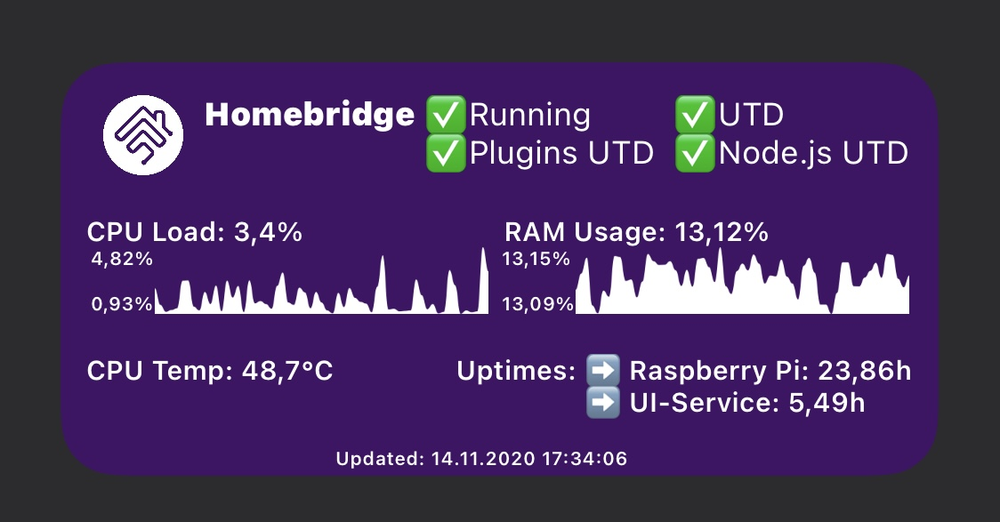
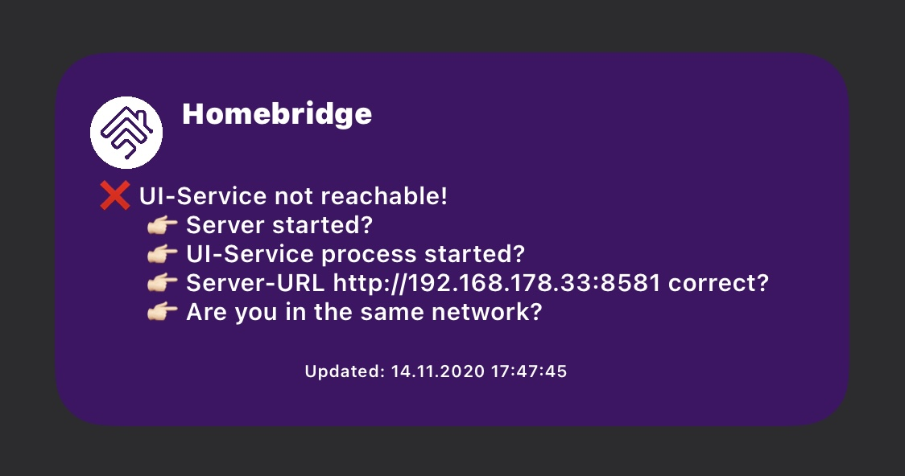

# Homebridge Status Widget
- Script for the iOS App Scriptable that shows a small summary of your Homebrige instance
- All infos shown are based and provided by the Homebridge Config UI X found at https://github.com/oznu/homebridge-config-ui-x
- Thanks to the github user oznu for providing such a nice programm!
- This script does not work if you don't have the Homebridge service (Homebridge Config UI X) running
- also thanks to github user kevinkub for providing a line chart example at https://gist.github.com/kevinkub/b74f9c16f050576ae760a7730c19b8e2

# How to use
- you actually only need to configure 
   - the **location** of the system running the Homebridge Config UI X (the hb-service)
   - **username** of the administrator of the hb-service
   - **password** of the administrator of the hb-service
- the residual parameter can be tweaked a bit for your needs
   - e.g. the systemGuiName, the name of your system running the Homebridge Config UI X (the hb-service)
   - e.g. the timeout could be increased if your system does not respond within 1 second
- if your system is not reached within the specified timeout (currently 1sec) the following screen is shown: 

# Infos shown in the widget
- if Homebridge is running
- if Homebridge is up to date
- if all of the installed plugins (including Homebridge Config UI X) are up tp date
- if node.js is up to date
- CPU load
- CPU temperature
- RAM usage
- Uptime for the system the hb-service is running on
- Uptime for the hb-service (Homebridge Config UI X)